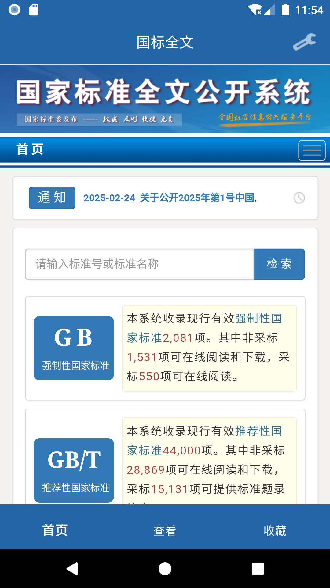
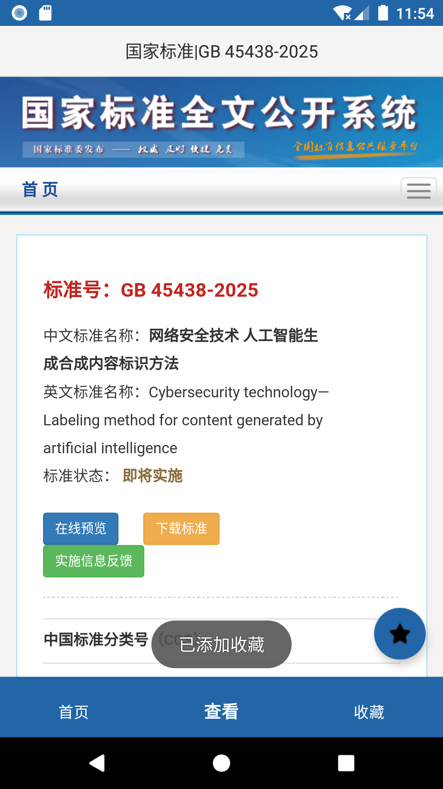
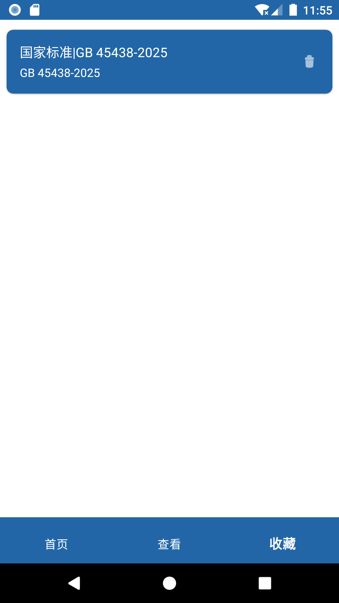

# 国标全文 Android App

这是一个完全使用 Cursor 辅助，基于 Java 语言开发的，用于收藏“国家标准全文公开”网中的标准的程序。

其实，使用浏览器和收藏夹，效果也是一样的 QAQ。

## 项目结构

```
app/
├── src/
│   ├── main/
│   │   ├── java/
│   │   │   └── com/
│   │   │       └── example/
│   │   │           └── gbqw/
│   │   │               ├── MainActivity.java
│   │   │               └── ...
│   │   └── res/
│   │       ├── layout/
│   │       │   └── activity_main.xml
│   │       └── ...
│   └── test/
└── build.gradle
```

## 开发环境要求

- JDK 8 或更高版本
- Gradle 8.1

## 安装说明

1. 克隆项目到本地
2. 使用 Android Studio 打开项目
3. 等待 Gradle 同步完成
4. 运行项目

## app 截图





